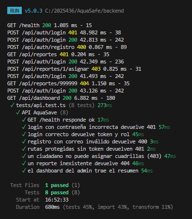

# AquaSave: Plan de pruebas

**Estudiante:** Michael Yohardi Aquino Arqueta (carné 2025436)
**Entorno:** local (Node.js + Express + TypeScript, MySQL). Pruebas manuales con Postman
**Usuarios de prueba:** admin@aquasave.test (administrador) y ciudadano@aquasave.test (ciudadano).

## 1. Pruebas manuales (Postman)

| ID | Caso | Esperado | Obtenido | Evidencia |
|---|---|---|---|---|
| P01 | Health check | 200 | 200 OK | P01-health.png |
| P02 | Login administrador | 200 y token | 200 OK | P02-login-admin.png |
| P03 | Login ciudadano | 200 y token | 200 OK | P03-login-ciudadano.png |
| P04 | Login con contraseña incorrecta | 401 | 401 OK | P04-login-incorrecto-401.png |
| P05 | Registro válido | 201 | 201 OK | P05-registro-201.png |
| P06 | Registro con correo repetido | 409 | 409 OK | P06-registro-duplicado-409.png |
| P07 | Registro con datos inválidos | 400 | 400 OK | P07-registro-invalido-400.png |
| P08 | Acceso sin token | 401 | 401 OK | P08-sin-token-401.png |
| P09 | Ver perfil | 200 | 200 OK | P09-perfil-200.png |
| P10 | Editar perfil | 200 | 200 OK | P10-perfil-actualizado.png |
| P11 | Crear zona (administrador) | 201 | 201 OK | P11-zona-crear-201.png |
| P12 | Crear zona (ciudadano) | 403 | 403 OK | P12-zona-ciudadano-403.png |
| P13 | Búsqueda y paginación de zonas | 200 | 200 OK | P13-zonas-busqueda-paginacion.png |
| P14 | Actualizar zona | 200 | 200 OK | P14-zona-actualizar-200.png |
| P15 | Eliminar zona sin uso | 200 | 200 OK | P15-zona-eliminar-200.png |
| P16 | Crear reporte con foto | 201 | 201 OK | P16-reporte-crear-201.png |
| P17 | Crear reporte con datos inválidos | 400 | 400 OK | P17-reporte-invalido-400.png |
| P18 | Listar reportes con filtros | 200 | 200 OK | P18-reportes-filtros-200.png |
| P19 | Reporte inexistente | 404 | 404 OK | P19-reporte-inexistente-404.png |
| P20 | Reporte de otro usuario | 404 | 404 OK | P20-reporte-ajeno-404.png |
| P21 | Eliminar zona con reportes | 409 | 409 OK | P21-zona-con-reportes-409.png |
| P22 | Asignar cuadrilla (ciudadano) | 403 | 403 OK | P22-asignar-ciudadano-403.png |
| P23 | Asignar cuadrilla (administrador) | 200 | 200 OK | P23-asignar-200.png |
| P24 | Cambio de estado no permitido | 409 | 409 OK | P24-estado-invalido-409.png |
| P25 | Pasar a en reparación | 200 | 200 OK | P25-estado-en-reparacion-200.png |
| P26 | Resolver reporte | 200 | 200 OK | P26-estado-resuelto-200.png |
| P27 | Detalle con historial | 200 | 200 OK | P27-reporte-detalle-historial.png |
| P28 | Dashboard | 200 | 200 OK | P28-dashboard-200.png |
| P29 | Listar usuarios (ciudadano) | 403 | 403 OK | P29-usuarios-ciudadano-403.png |
| P30 | Desactivar usuario y probar su login | 200 y luego 401 | 200 y 401 OK | P30-usuario-desactivado-200.png, P30-login-desactivado-401.png |

## 2. Pruebas automatizadas (Vitest, `npm test`)

8 pruebas, las 8 aprobadas: health, login incorrecto, login correcto, registro inválido, ruta sin token, ciudadano sin permiso de asignar, reporte inexistente y dashboard.

Evidencia: 

## 3. Incidencias encontradas y corregidas

| Incidencia | Solución |
|---|---|
| `npm run db:init` fallaba porque Windows no reconocía el comando `mysql` | Se creó `db/init.ts`, que ejecuta el schema con Node |
| `errorHandler` estaba antes de las rutas y no capturaba sus errores | Se movió al final de `app.ts` |
| Los tokens de Postman se mezclaban entre administrador y ciudadano | Cada script se puso en su propia petición de login |

## 4. Pendiente (se completa con el frontend)

Pruebas automatizadas de Angular, revisión responsiva, compatibilidad en dos navegadores y pruebas en producción.
